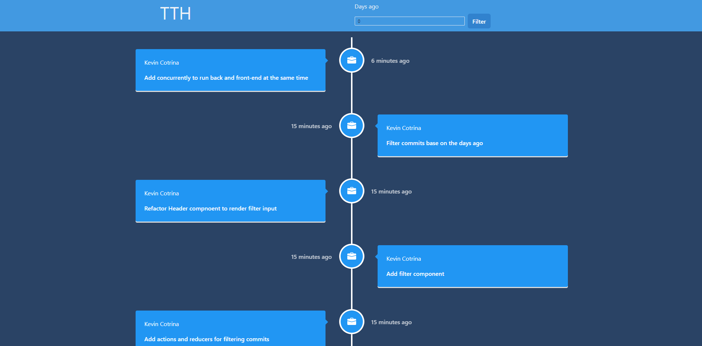

# MTake Home Test (THT)

> This is an application where the user will be able to see the commits history of an specific repository

## :hammer: Built with

- React
- Redux
- chakra-UI
- JavaScript
- Standard
- Node.js
- Express.js
- VS code

To get a local copy up and running follow these simple steps:

1. Go to the [repository page](https://github.com/kcotrinam/take-home-test).
2. Press the "Code" button and copy the link.
3. Clone it using git command `git clone <link>`.

## :construction_worker: How to use?

1. Move to the folder: `cd take-home-test`.
2. run `npm install`.
3. on your command line run: `npm run dev`.
4. You will see all the commits made for the project.
5. Add a number in the filter input to show specific commits.

## :bust_in_silhouette: Author

👤 **Kevin Cotrina**

- GitHub: [kcotrinam](https://github.com/kcotrinam)
- Twitter: [@kcotrinam_dev](https://twitter.com/kcotrinam_dev)
- LinkedIn: [KevinCotrina](https://www.linkedin.com/in/kevincotrina/)

## 🤝 :raised_hand: :raised_hand: Contributions

Contributions, issues, and feature requests are welcome!

Feel free to check the [issues page](https://github.com/kcotrinam/take-home-test/issues).

## :muscle: Show your support

Give a ⭐️ if you like this project!

## :grey_exclamation: Acknowledgment

- [Fulltimeforce ](https://fulltimeforce.com/)

## 📝 License

This project is [MIT](LICENSE) licensed.
